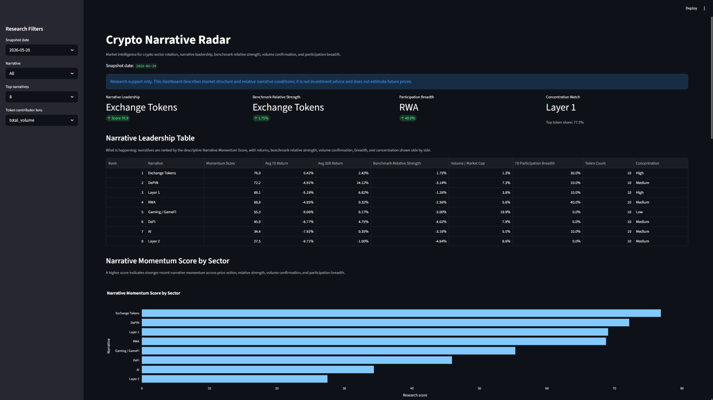
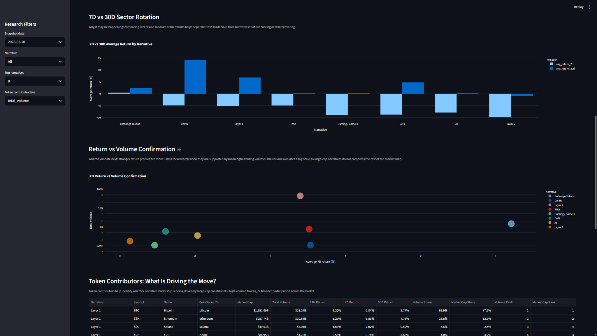

# Crypto Narrative Radar

## Project Overview

Crypto Narrative Radar is a Python-based crypto market intelligence project that tracks narrative-level momentum across major digital asset sectors such as DeFi, Layer 1, Layer 2, RWA, AI, DePIN, Gaming / GameFi, and Exchange Tokens.

The project transforms CoinGecko token market data into structured research outputs, including narrative rankings, relative strength metrics, volume confirmation, breadth of participation, concentration review, historical trend views, SQL analytics tables, a Streamlit dashboard, and a static HTML research report.

It is designed as a research support workflow for monitoring crypto narrative rotation and market structure. It is not a trading bot, price prediction model, investment advice product, or buy/sell signal generator.

## Why Narrative-Level Market Intelligence Matters

Crypto markets often move by narrative rather than by isolated token performance. Analysts may need to know whether AI tokens are broadly strengthening, whether Layer 2 participation is narrowing, whether DeFi volume confirmation is improving, or whether a move is concentrated in only a few large assets.

Crypto Narrative Radar creates a repeatable way to compare narrative-level market conditions across sectors. The project helps answer research questions such as:

- Which narratives are leading current market activity?
- Are narratives showing relative strength versus BTC and ETH?
- Is participation broad across tokens or concentrated in a few constituents?
- Is market movement supported by trading volume?
- Which tokens are contributing most to each narrative view?
- How have narrative-level metrics changed across recent historical conditions?

## What This Project Does

Crypto Narrative Radar follows a taxonomy-driven market intelligence workflow:

```text
taxonomy -> CoinGecko data -> token snapshots -> narrative metrics -> scoring -> dashboard/report outputs
```

The project:

- Maintains a curated token-to-narrative taxonomy.
- Fetches token-level market data from CoinGecko.
- Produces current token market snapshots.
- Aggregates token data into narrative-level metrics.
- Calculates a transparent Narrative Momentum Score V1.
- Reviews relative strength versus BTC and ETH.
- Measures volume confirmation and breadth of participation.
- Uses DuckDB SQL for narrative summaries, token contributors, and concentration review.
- Builds historical token and narrative datasets.
- Presents outputs through a Streamlit dashboard and static HTML research report.
- Runs the current snapshot pipeline locally or through GitHub Actions.

## Current Outputs

Crypto Narrative Radar currently produces both interactive and static research outputs.

### Streamlit Dashboard

The Streamlit dashboard provides an interactive research interface for exploring:

- Current narrative rankings
- Narrative Momentum Score V1
- 24H, 7D, and 30D performance comparisons
- Relative strength versus BTC and ETH
- Volume confirmation
- Breadth of positive token participation
- Concentration review
- Token-level contributors
- Historical Narrative Trends

The dashboard is designed for exploratory research, allowing users to filter, compare, and review narrative-level market conditions.

Run it with:

```bash
streamlit run dashboard/streamlit_app.py
```

### Static HTML Research Report

The static HTML report provides an analyst-readable market summary.

Current report path:

```text
reports/html/latest.html
```

Sample HTML research report:

```text
docs/showcase/sample_2026-05-20.html
```

Generate it with:

```bash
python scripts/generate_html_report.py
```

The report is designed for research communication. It summarizes narrative rankings, current market context, token-level contributors, concentration review, historical context, methodology notes, and limitations in a format that can be reviewed without running the dashboard.

### CSV and SQL Outputs

The project also generates structured data outputs, including:

- Current token market snapshots
- Current narrative metrics
- Current narrative rankings
- DuckDB SQL analytics outputs
- Historical token market history
- Historical narrative metrics

These outputs support repeatable research review, dashboard visualizations, static reporting, and future portfolio extensions.

## Dashboard and Report Preview

The dashboard is built for market research workflows rather than trade execution. It emphasizes narrative rankings, relative momentum, volume confirmation, breadth of participation, concentration context, token contributors, and historical narrative trends.





The static HTML report complements the dashboard by turning the latest processed outputs into a recruiter-friendly research note that can be opened locally at:

```text
reports/html/latest.html
```

## Research Methodology

Crypto Narrative Radar follows a taxonomy-driven market intelligence workflow.

### 1. Define the Token Universe

A curated taxonomy maps each token to one primary crypto narrative, such as DeFi, Layer 1, Layer 2, RWA, AI, DePIN, Gaming / GameFi, or Exchange Tokens.

The taxonomy file is:

```text
data/reference/taxonomy.csv
```

Secondary narrative tags preserve research context for tokens that sit across multiple themes, but the MVP scoring framework avoids double-counting by using one primary narrative per token.

### 2. Collect CoinGecko Market Data

The current snapshot pipeline fetches token-level market data from CoinGecko, including price, market capitalization, trading volume, and percentage returns across multiple timeframes.

### 3. Create Token-Level Market Snapshots

Raw market data is cleaned and saved into structured token-level CSV outputs for validation, analysis, and reuse.

### 4. Aggregate Metrics by Narrative

Tokens are grouped by primary narrative to calculate narrative-level metrics such as average returns, median returns, total market cap, total volume, volume-to-market-cap, relative strength, and breadth of positive participation.

### 5. Calculate Narrative Momentum Score V1

The project ranks narratives using an explainable scoring framework based on price momentum, relative strength, volume confirmation, and breadth of participation.

### 6. Add SQL Analytics and Concentration Review

DuckDB SQL outputs provide additional research views for narrative summaries, token-level contributors, and concentration context.

### 7. Add Historical Context

Historical token and narrative datasets allow the dashboard to show how narrative-level metrics evolved across recent market conditions.

### 8. Communicate Research Outputs

The final outputs are presented through both an interactive Streamlit dashboard and a static HTML research report.

## Narrative Momentum Score V1

The Narrative Momentum Score V1 is designed to compare current market momentum across crypto narratives.

The score uses the current V1 weighting framework:

```text
40% price momentum
25% relative strength
20% volume confirmation
15% breadth of participation
```

The score considers research dimensions such as:

- Short-term and medium-term narrative performance
- Relative strength versus BTC and ETH
- Volume confirmation
- Breadth of positive token participation
- Token-level contributors and concentration context

The score is intended to help identify narratives that may deserve further research. It does not predict future returns, generate trading signals, or recommend portfolio decisions.

## Data Outputs

The project generates several layers of research-ready outputs.

### Current Snapshot Outputs

Processed current snapshot outputs are written under date-stamped folders:

```text
data/processed/YYYY-MM-DD/token_market_snapshot_YYYY-MM-DD.csv
data/processed/YYYY-MM-DD/narrative_metrics.csv
data/processed/YYYY-MM-DD/narrative_ranking.csv
```

### SQL Analytics Outputs

DuckDB SQL analytics outputs are written to the same processed snapshot folder:

```text
data/processed/YYYY-MM-DD/sql_narrative_summary.csv
data/processed/YYYY-MM-DD/sql_top_token_contributors.csv
data/processed/YYYY-MM-DD/sql_concentration_review.csv
```

The SQL query files are:

```text
sql/01_narrative_summary.sql
sql/02_top_token_contributors.sql
sql/03_concentration_review.sql
```

### Historical Outputs

Historical outputs are written under:

```text
data/processed/historical/token_market_history_90d.csv
data/processed/historical/narrative_market_history_90d.csv
```

Historical outputs support the dashboard's Historical Narrative Trends view and allow users to review how narrative-level metrics changed over time.

### Report Outputs

Static HTML report outputs are written under:

```text
reports/html/crypto_narrative_report_YYYY-MM-DD.html
reports/html/latest.html
```

Generated processed data and reports are local outputs and are generally not committed unless intentionally included as small portfolio examples.

## Repository Structure

```text
crypto_narrative_radar/
  api/
  data/
  dashboard/
  metrics/
  reports/
  config.py

dashboard/
  streamlit_app.py

data/
  reference/
  raw/
  processed/

reports/
  html/

scripts/
  backfill_coingecko_history.py
  calculate_historical_narrative_metrics.py
  calculate_narrative_metrics.py
  fetch_coingecko_markets.py
  generate_html_report.py
  run_daily_pipeline.py
  run_sql_analytics.py
  validate_historical_market_data.py
  validate_historical_narrative_metrics.py
  validate_market_snapshot.py
  validate_narrative_metrics.py
  validate_sql_outputs.py
  validate_taxonomy.py

sql/
  01_narrative_summary.sql
  02_top_token_contributors.sql
  03_concentration_review.sql

templates/
  research_report.html.j2

tests/

.github/
  workflows/
    daily_pipeline.yml
```

## How to Run Locally

### 1. Clone the repository

```bash
git clone https://github.com/YOUR_USERNAME/crypto-narrative-radar.git
cd crypto-narrative-radar
```

### 2. Create and activate a virtual environment

```bash
python -m venv .venv
```

macOS / Linux:

```bash
source .venv/bin/activate
```

Windows:

```bash
.venv\Scripts\activate
```

### 3. Install dependencies

```bash
python -m pip install -r requirements.txt
```

### 4. Run the current snapshot pipeline

```bash
python scripts/run_daily_pipeline.py
```

This validates the taxonomy, fetches CoinGecko market data, validates the current market snapshot, calculates narrative metrics, runs DuckDB SQL analytics, and validates SQL outputs.

### 5. Launch the Streamlit dashboard

```bash
streamlit run dashboard/streamlit_app.py
```

### 6. Generate the static HTML report

Generate the latest static report:

```bash
python scripts/generate_html_report.py
```

Generate a report for a specific snapshot date:

```bash
python scripts/generate_html_report.py --date YYYY-MM-DD
```

Latest report output:

```text
reports/html/latest.html
```

### 7. Build historical datasets

Backfill token-level historical market data:

```bash
python scripts/backfill_coingecko_history.py --days 90
python scripts/validate_historical_market_data.py
```

Calculate and validate historical narrative metrics:

```bash
python scripts/calculate_historical_narrative_metrics.py
python scripts/validate_historical_narrative_metrics.py
```

### 8. Run tests

```bash
pytest
```

If Python is not available directly on `PATH`, use:

```bash
python -m pytest tests
```

## Skills Demonstrated

This project demonstrates:

### Python and pandas

- API data ingestion
- CSV-based data pipeline design
- Data cleaning and validation
- Groupby aggregation
- Time-series data preparation
- Reusable script structure

### Crypto Market Research

- Narrative taxonomy design
- Sector-level market analysis
- Relative strength review
- Volume confirmation
- Breadth of participation
- Concentration analysis
- Token contributor review

### Analytics and Reporting

- DuckDB SQL analytics
- Streamlit dashboard development
- Static HTML report generation with Jinja2
- Historical trend visualization
- Research communication for technical and non-technical readers

### Product and Research Workflow

- Turning raw market data into analyst-facing outputs
- Balancing simplicity, transparency, and usability
- Documenting assumptions and limitations
- Using automation for repeatable daily snapshots
- Keeping outputs explainable for portfolio review and interviews

## Limitations

Crypto Narrative Radar is a research support tool and has several important limitations:

- It does not predict token prices.
- It does not generate buy, sell, or hold signals.
- It does not execute trades.
- It does not claim to produce alpha.
- It is not investment advice.
- CoinGecko data may contain missing values, delays, outliers, or API limitations.
- Narrative classification is manually curated and may involve subjective judgment.
- Smaller or less liquid tokens can distort equal-weighted narrative metrics.
- Short-term returns can be noisy during volatile market conditions.
- Current scoring focuses on market momentum and does not yet include deeper fundamentals such as TVL, fees, revenue, stablecoin flows, or developer activity.
- Historical analysis is intended for context, not backtested trading strategy validation.

## Future Improvements

Potential future improvements include:

- Add DeFiLlama fundamentals such as TVL, fees, revenue, DEX volume, and stablecoin metrics.
- Add market-cap-weighted narrative metrics.
- Improve liquidity and data quality filters.
- Expand the narrative taxonomy.
- Add more historical comparison windows.
- Add narrative heatmaps for faster sector comparison.
- Add weekly research report generation.
- Improve dashboard screenshots and portfolio presentation.
- Add clearer methodology documentation for non-technical readers.

DeFiLlama would be a future fundamentals overlay, not a replacement for the current CoinGecko-based momentum framework.

## AI-Assisted Development Disclosure

This project was developed with AI assistance for planning, code drafting, refactoring, documentation, debugging, and QA support.

The project owner reviewed, tested, and validated the outputs. The goal is to demonstrate practical AI-assisted development while maintaining understanding of the data pipeline, research methodology, scoring framework, market interpretation, and limitations.
